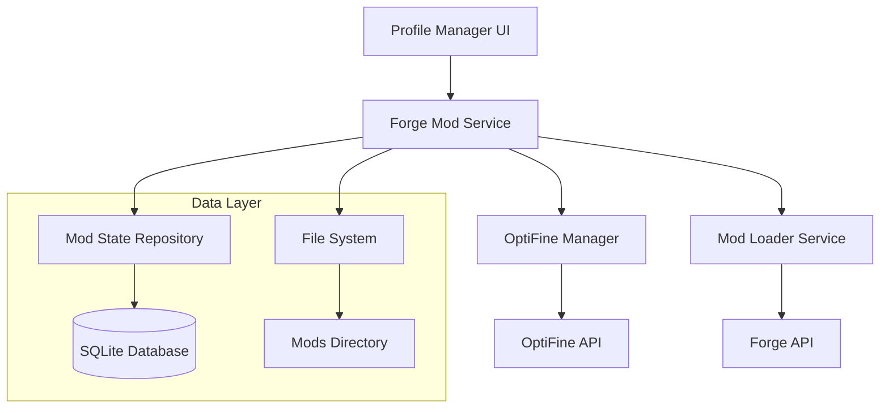

# Design Document

## Overview

The Forge mod management system extends the existing ModLoaderService to provide comprehensive Forge mod loader support with OptiFine as the default mod. The system integrates with the current launcher architecture while providing specialized handling for Forge-specific features and OptiFine integration.

## Architecture

### High-Level Architecture



### Component Integration

The Forge mod management system integrates with existing components:

- **ModLoaderService**: Extended to handle Forge-specific installation logic
- **ProfileService**: Enhanced to support Forge profile creation with OptiFine
- **Database**: New tables for Forge mod state and OptiFine preferences
- **UI Components**: New Forge-specific mod management interface

## Components and Interfaces

### ForgeModService

Primary service for managing Forge mods and OptiFine integration.

```typescript
interface ForgeModService {
  // Profile Management
  createForgeProfile(gameVersion: string, profileName: string): Promise<ForgeProfile>
  installForgeWithOptiFine(profile: ForgeProfile): Promise<boolean>
  
  // OptiFine Management
  downloadOptiFine(gameVersion: string, forgeVersion: string): Promise<OptiFineInfo>
  installOptiFine(profile: ForgeProfile, optifine: OptiFineInfo): Promise<boolean>
  
  // Mod State Management
  getModStates(profileId: string): Promise<ModState[]>
  updateModState(profileId: string, modName: string, enabled: boolean): Promise<void>
  applyModStates(profileId: string): Promise<void>
}
```

### OptiFineManager

Specialized component for OptiFine download, installation, and version management.

```typescript
interface OptiFineManager {
  getAvailableVersions(gameVersion: string): Promise<OptiFineVersion[]>
  downloadOptiFine(version: OptiFineVersion, targetPath: string): Promise<string>
  verifyOptiFineCompatibility(gameVersion: string, forgeVersion: string): Promise<OptiFineVersion | null>
  extractOptiFineFromInstaller(installerPath: string, targetPath: string): Promise<boolean>
}
```

### ForgeModRepository

Data access layer for Forge mod state persistence.

```typescript
interface ForgeModRepository {
  saveModState(profileId: string, modName: string, enabled: boolean): Promise<void>
  getModStates(profileId: string): Promise<ModState[]>
  deleteModStates(profileId: string): Promise<void>
  getDefaultModStates(): ModState[]
}
```

## Data Models

### ForgeProfile

```typescript
interface ForgeProfile extends GameProfile {
  modLoader: 'forge'
  forgeVersion: string
  optifineEnabled: boolean
  optifineVersion?: string
  modsDirectory: string
}
```

### OptiFineInfo

```typescript
interface OptiFineInfo {
  version: string
  gameVersion: string
  forgeVersion: string
  downloadUrl: string
  filename: string
  fileSize: number
  checksum: string
}
```

### ModState

```typescript
interface ModState {
  profileId: string
  modName: string
  enabled: boolean
  filePath: string
  lastModified: Date
}
```

### Database Schema

New tables to support Forge mod management:

```sql
-- Forge mod states
CREATE TABLE forge_mod_states (
  id INTEGER PRIMARY KEY AUTOINCREMENT,
  profile_id TEXT NOT NULL,
  mod_name TEXT NOT NULL,
  enabled BOOLEAN NOT NULL DEFAULT 1,
  file_path TEXT NOT NULL,
  created_at DATETIME DEFAULT CURRENT_TIMESTAMP,
  updated_at DATETIME DEFAULT CURRENT_TIMESTAMP,
  UNIQUE(profile_id, mod_name)
);

-- OptiFine configurations
CREATE TABLE optifine_configs (
  id INTEGER PRIMARY KEY AUTOINCREMENT,
  profile_id TEXT NOT NULL UNIQUE,
  version TEXT NOT NULL,
  enabled BOOLEAN NOT NULL DEFAULT 1,
  download_url TEXT,
  file_path TEXT,
  created_at DATETIME DEFAULT CURRENT_TIMESTAMP,
  updated_at DATETIME DEFAULT CURRENT_TIMESTAMP
);
```

## Error Handling

### Error Categories

1. **Installation Errors**
   - Forge installer download failures
   - Forge installation process errors
   - OptiFine download/installation failures

2. **Compatibility Errors**
   - Unsupported Minecraft version for Forge
   - OptiFine version incompatibility
   - Mod conflicts

3. **File System Errors**
   - Insufficient disk space
   - Permission denied for mod directory
   - Corrupted mod files

### Error Recovery Strategies

```typescript
interface ErrorRecoveryStrategy {
  retryWithBackoff(operation: () => Promise<any>, maxRetries: number): Promise<any>
  fallbackToAlternativeSource(primaryUrl: string, fallbackUrls: string[]): Promise<string>
  cleanupPartialInstallation(installationPath: string): Promise<void>
  validateAndRepairModDirectory(modsPath: string): Promise<boolean>
}
```

### User-Facing Error Messages

- Clear, actionable error descriptions
- Suggested solutions for common issues
- Option to retry failed operations
- Links to troubleshooting resources

## Testing Strategy

### Unit Tests

- **ForgeModService**: Test mod installation, state management, and OptiFine integration
- **OptiFineManager**: Test version detection, download, and compatibility checking
- **ForgeModRepository**: Test database operations and data persistence
- **Error handling**: Test recovery strategies and error propagation

### Integration Tests

- **End-to-end profile creation**: Create Forge profile with OptiFine installation
- **Mod state persistence**: Verify mod states are saved and restored correctly
- **File system operations**: Test mod enabling/disabling through file renaming
- **Cross-component communication**: Test service interactions and data flow

### Manual Testing Scenarios

1. Create new Forge profile with OptiFine
2. Enable/disable OptiFine and verify game launch
3. Add additional Forge mods and manage their states
4. Test with different Minecraft/Forge version combinations
5. Verify error handling for network failures and invalid installations

## Performance Considerations

### Optimization Strategies

1. **Caching**: Cache OptiFine version information and download URLs
2. **Parallel Downloads**: Download Forge installer and OptiFine concurrently when possible
3. **Lazy Loading**: Load mod states only when needed for specific profiles
4. **File System Efficiency**: Batch file operations for mod state changes

### Resource Management

- Limit concurrent downloads to prevent bandwidth saturation
- Clean up temporary files after installation
- Monitor disk space before large downloads
- Use streaming for large file downloads to minimize memory usage

## Security Considerations

### Download Security

- Verify checksums for all downloaded files
- Use HTTPS for all external API calls and downloads
- Validate file signatures where available
- Scan downloaded files for malware indicators

### File System Security

- Validate file paths to prevent directory traversal
- Set appropriate file permissions on created directories
- Sanitize user input for profile names and paths
- Implement safe file deletion with confirmation

## UI/UX Design

### Forge Profile Creation Flow

1. **Version Selection**: Choose Minecraft version with Forge compatibility indicator
2. **Forge Installation**: Progress indicator for Forge installer download and execution
3. **OptiFine Setup**: Automatic OptiFine version selection with manual override option
4. **Profile Configuration**: Set profile name, game directory, and initial settings

### Mod Management Interface

```mermaid
wireframe
  title Forge Mod Management
  
  section Profile Info
    text "Profile: My Forge Profile (MC 1.20.1, Forge 47.2.0)"
  
  section Mods List
    checkbox "OptiFine HD U I5" checked
    text "Graphics optimization and performance enhancement"
    
    checkbox "JEI (Just Enough Items)" unchecked
    text "Recipe viewing and item management"
    
    button "Add More Mods"
  
  section Actions
    button "Apply Changes"
    button "Launch Game"
    button "Cancel"
```

### Progress Indicators

- Forge installer download progress
- OptiFine download and installation progress
- Mod state application progress
- Clear status messages for each operation phase