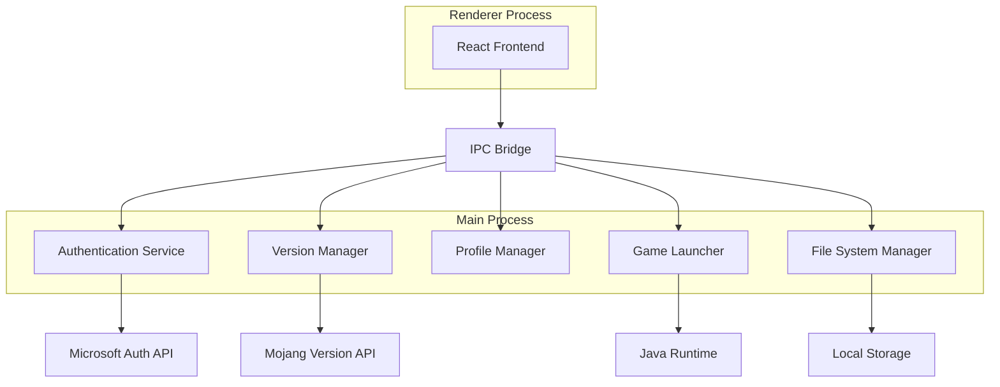

# Minecraft Launcher Design Document

## Overview

The Minecraft launcher will be built as a cross-platform desktop application using Electron with React for the frontend and Node.js for the backend logic. This architecture provides native desktop integration while maintaining a modern, responsive user interface. The application will handle authentication, version management, profile configuration, and game launching through a modular design that separates concerns and enables easy maintenance.

## Architecture

### High-Level Architecture



### Technology Stack

- **Frontend**: React 18 with TypeScript for type safety
- **Desktop Framework**: Electron for cross-platform desktop application
- **State Management**: Zustand for lightweight state management
- **Styling**: Tailwind CSS for rapid UI development
- **Backend Logic**: Node.js with TypeScript
- **Data Storage**: SQLite for local data persistence
- **HTTP Client**: Axios for API communications
- **File Operations**: Node.js fs/promises for async file handling

## Components and Interfaces

### 1. Authentication Service

**Purpose**: Handle Microsoft/Mojang authentication and token management

**Key Methods**:
- `authenticateUser()`: Initiate OAuth flow with Microsoft
- `refreshToken()`: Automatically refresh expired tokens
- `validateSession()`: Check if current session is valid
- `logout()`: Clear stored credentials

**Data Storage**:
- Encrypted token storage using electron-store
- User profile information (username, UUID, skin URL)

### 2. Version Manager

**Purpose**: Manage Minecraft version discovery, download, and installation

**Key Methods**:
- `fetchAvailableVersions()`: Get version manifest from Mojang API
- `downloadVersion(versionId)`: Download and install specific version
- `validateInstallation(versionId)`: Verify file integrity
- `getInstalledVersions()`: List locally available versions

**API Integration**:
- Mojang Version Manifest API: `https://piston-meta.mojang.com/mc/game/version_manifest_v2.json`
- Individual version metadata and asset downloads

### 3. Profile Manager

**Purpose**: Handle user profiles, configurations, and settings

**Database Schema**:
```sql
CREATE TABLE profiles (
    id INTEGER PRIMARY KEY,
    name TEXT NOT NULL,
    version_id TEXT NOT NULL,
    installation_dir TEXT,
    memory_min INTEGER DEFAULT 1024,
    memory_max INTEGER DEFAULT 2048,
    jvm_args TEXT,
    mod_loader TEXT,
    created_at DATETIME DEFAULT CURRENT_TIMESTAMP,
    last_used DATETIME
);
```

**Key Methods**:
- `createProfile(config)`: Create new profile with validation
- `updateProfile(id, config)`: Modify existing profile
- `deleteProfile(id)`: Remove profile and optionally clean files
- `getProfiles()`: Retrieve all user profiles

### 4. Game Launcher

**Purpose**: Launch Minecraft with proper configuration and monitor process

**Key Methods**:
- `launchGame(profileId)`: Start Minecraft with profile settings
- `buildLaunchCommand(profile)`: Construct Java command with arguments
- `validateJavaInstallation()`: Check Java availability and version
- `monitorGameProcess()`: Track game status and handle crashes

**Launch Process**:
1. Validate profile configuration and file integrity
2. Construct classpath with game libraries and assets
3. Build JVM arguments including memory settings
4. Execute Java process with proper working directory
5. Monitor process and handle exit codes

### 5. Mod Loader Integration

**Purpose**: Support for Forge, Fabric, and other mod loaders

**Key Methods**:
- `detectModLoaders(versionId)`: Find available mod loaders for version
- `installModLoader(type, version)`: Download and install mod loader
- `createModdedProfile(baseVersion, modLoader)`: Set up modded profile
- `validateModCompatibility()`: Check mod loader compatibility

**Supported Mod Loaders**:
- Minecraft Forge (via Forge installer API)
- Fabric (via Fabric Meta API)
- Quilt (via Quilt Meta API)

## Data Models

### User Profile Model
```typescript
interface UserProfile {
  id: string;
  name: string;
  versionId: string;
  installationDir: string;
  memoryMin: number;
  memoryMax: number;
  jvmArgs: string[];
  modLoader?: {
    type: 'forge' | 'fabric' | 'quilt';
    version: string;
  };
  createdAt: Date;
  lastUsed: Date;
}
```

### Game Version Model
```typescript
interface GameVersion {
  id: string;
  type: 'release' | 'snapshot' | 'old_beta' | 'old_alpha';
  url: string;
  time: Date;
  releaseTime: Date;
  sha1: string;
  complianceLevel: number;
}
```

### Authentication Model
```typescript
interface AuthenticationData {
  accessToken: string;
  refreshToken: string;
  expiresAt: Date;
  userProfile: {
    id: string;
    name: string;
    skinUrl?: string;
  };
}
```

## Error Handling

### Authentication Errors
- **Invalid Credentials**: Clear stored tokens and prompt re-authentication
- **Network Errors**: Retry with exponential backoff, offline mode for cached data
- **Token Expiry**: Automatic refresh with fallback to re-authentication

### Download Errors
- **Network Interruption**: Resume capability with partial download tracking
- **Corrupted Files**: Automatic re-download with integrity verification
- **Insufficient Storage**: Clear error message with storage requirements

### Launch Errors
- **Missing Java**: Automatic detection and download suggestion
- **Invalid Profile**: Validation with specific error messages and fixes
- **Game Crashes**: Log collection and troubleshooting suggestions

### Error Logging
- Structured logging with winston for debugging
- User-friendly error messages with actionable solutions
- Automatic error reporting (opt-in) for crash analytics

## Testing Strategy

### Unit Testing
- Jest for business logic testing
- Mock external APIs and file system operations
- Test authentication flows, profile management, and version handling
- Achieve 80%+ code coverage for critical paths

### Integration Testing
- Test API integrations with Mojang services
- Validate file download and installation processes
- Test game launch scenarios with different configurations
- Mock Java runtime for consistent testing environment

### End-to-End Testing
- Playwright for full application workflow testing
- Test complete user journeys from login to game launch
- Validate UI interactions and state management
- Test across different operating systems (Windows, macOS, Linux)

### Performance Testing
- Memory usage monitoring during downloads and launches
- Startup time optimization and measurement
- Large file download performance validation
- Concurrent operation handling (multiple downloads)

## Security Considerations

### Token Security
- Encrypt stored authentication tokens using OS keychain
- Implement secure token refresh mechanisms
- Clear sensitive data on application exit

### File System Security
- Validate all file paths to prevent directory traversal
- Implement proper file permissions for game directories
- Scan downloaded files for basic integrity checks

### Network Security
- Use HTTPS for all external API communications
- Implement certificate pinning for critical endpoints
- Validate downloaded file checksums against official sources

## Performance Optimizations

### Download Management
- Parallel downloads for game assets with connection pooling
- Resume capability for interrupted downloads
- Compression support for faster transfers
- Local caching of version manifests and metadata

### Memory Management
- Lazy loading of version lists and profile data
- Efficient file streaming for large downloads
- Proper cleanup of temporary files and processes
- Memory-mapped file access for large asset files

### UI Responsiveness
- Background processing for all long-running operations
- Progress indicators with real-time updates
- Debounced user input handling
- Virtual scrolling for large lists (versions, profiles)